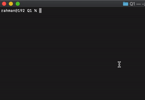

**Q1 Story Refactory.id**

> **Result**



> **Run**
 
1. Clone this repo
2. Go to Q1 Folder
3. Execute with

```
go run .
```

Story
=
A small restaurant wants to have an app to print a payment receipt, the resto has a dot matrix printer. While you developing the app to print that receipt, you have to make sure every input and output working as expected when printing the receipt by following the required parameters of dot matrix printer.

Given:
=
Max width of one line is 30 characters.

Known/Constraints:
=
When text is more than 30 characters, the rest must be over to the new line.
Output at the section of price list must be connected with dot character (...) between the item name until the item price.
Item name always aligned to left, Item price always aligned to right with Rp as prefix.

Expected Input:
=
Simple app, you can just make it running on command line, no fancy here, just must have there inputs:
Input resto name
Input date of print
Input cashier name
Input item and price, for this can be multiple times input until the user said exit.

Expected Output:
=

```
     Warung Makan Sederhana
Tanggal :  2020/12/2020 15:30:00 
Nama Kasir : 	    {{YourName}}
================================
Nasi.....................Rp5.000
Lauk....................Rp10.000
Minum....................Rp5.000

Total...................Rp20.000
```


