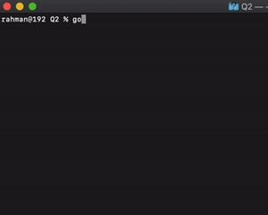

**Q2 JSON Manipulation Refactory.id**

> **Result**



> **Run**
 
1. Clone this repo
2. Go to Q2 Folder
3. Execute with

```
go run .
```

We have JSON Data:
=
https://gist.github.com/dhamanutd/6993984928506eea49908c2e3fcbc628

**The tasks to create functions:**
1. Find users who don't have any phone numbers. 
2. Find users who have articles. 
3. Find users who have "annis" on their name. 
4. Find users who have articles on the year 2020. 
5. Find users who are born in 1986. 
6. Find articles that contain "tips" on the title. 
7. Find articles published before August 2019.


