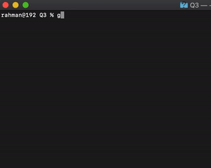

**Q3 JSON Manipulation Refactory.id**

> **Result**



> **Run**
 
1. Clone this repo
2. Go to Q3 Folder
3. Execute with

```
go run .
```

JSON Data:
=
https://gist.github.com/dhamanutd/97aa0d2131903ea8c071721032c7b2a3

**The tasks to create functions:**
1. Find items in the Meeting Room.
2. Find all electronic devices.
3. Find all the furniture.
4. Find all items were purchased on 16 Januari 2020.
5. Find all items with brown color.


