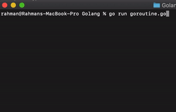

**Q5 Backend Refactory.id**

> **Fix Result**

 

> **Run**
1. Clone this repo
2. Go to **Q4->BE->Golang** Folder
3. Execute with

```
go run goroutine.go
```

Case
=

```
//What will be printed when the code below is executed?
//And fix the issue to assure that `len(m)` is printed as 10.

package main

import (
	"sync"
)

const N = 10

func main() {
	m := make(map[int]int)

	wg := &sync.WaitGroup{}
	mu := &sync.Mutex{}
        wg.Add(N)
	for i := 0; i < N; i++ {
		go func() {
			defer wg.Done()
			mu.Lock()
			m[i] = i
			mu.Unlock()
		}()
	}
	wg.Wait()
	println(len(m))
}
```
