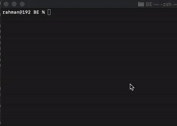
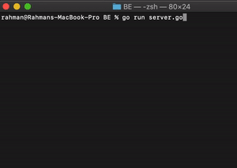
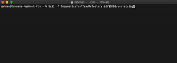

**Q5 Backend Refactory.id**

> **Result Client & Server**

 

> **Result Log**



> **Run**

Build client-server app regarding these criterias:
Every minutes client will send POST request to server with following payload::
```
// Header
"X-RANDOM": "93f9h3dx"
// Body
{ "counter": 1 }
// Header
"X-RANDOM": "fe9g83jm"
// Body
{ "counter": 2 }
// Header
"X-RANDOM": "igrijd9p"
// Body
{ "counter": 3 }
```

Server will receive a request from the client above. Then the server will save those received request to server.log file. After that server must return a response to the client with HTTP status code 201.
Example server.log:
```
[2020-07-28T16:23:40+07:00] Success: POST http://192.168.1.30/ {"counter": 1, "X-RANDOM": "93f9h3dx"}
[2020-07-28T16:24:40+07:00] Success: POST http://192.168.1.30/ {"counter": 2, "X-RANDOM": "fe9g83jm"}
[2020-07-28T16:25:40+07:00] Success: POST http://192.168.1.30/ {"counter": 3, "X-RANDOM": "igrijd9p"}
```
